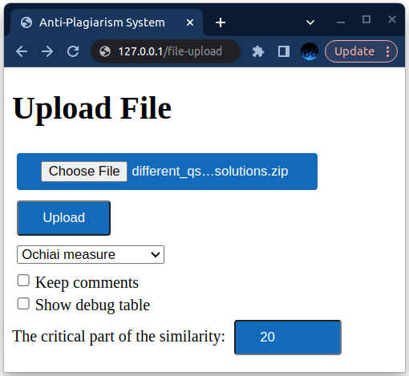
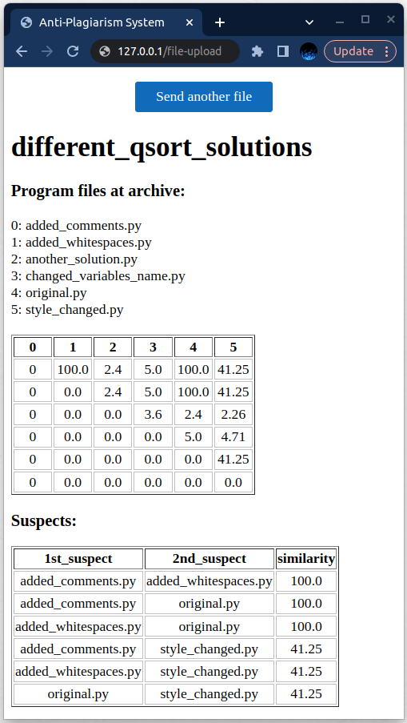

# REST API anti-plagiarism

## <u>Разобранны следующие операции:</u>
- GET:       /                    - Main page.
- GET:       /file-upload         - Интерфейс для загрузки архива.
- POST:      /file-upload         - Загружает zip архив с программами и проверяет их на плагиат.

### <u>Для запуска приложения (Предварительно долежн быть установлен docker):</u>

```
make build && make run
```

### To send test zip archive to server:

```
make test
```

### Or send your own archive:
- using a cURL request
    ```
    curl -X POST \
        -F 'algorithm=shingle(or jaccard or Otsuka Ochiai measure)' \
        -F 'file=@your/path/to/file.zip' \
        http://127.0.0.1:80/file-upload
    ```

- send through [graphic interface](http://127.0.0.1/).


